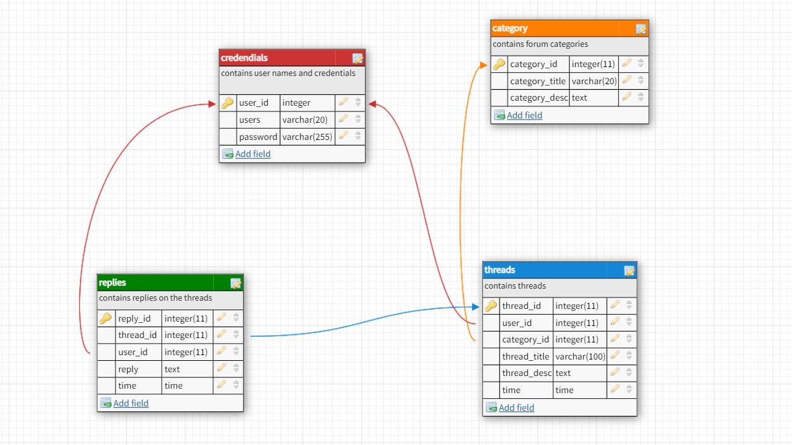

## IMPORTANT NOTES

* **mysqli** database is required for hosting this app

* name of the database is __forum__

* make sure to change the default servername, username and password for the database connection by edditng the [this](./Database/connect.php) file

* following is schema for the database. *make sure your database follows the schema*

